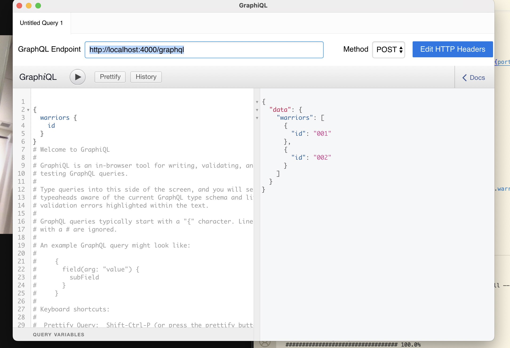

# Example GraphQL Server in Node.JS
A quick graphql implementation™

_Note I did not make this_

📝 Note! In GraphQL, you can make requests using the POST http method and
by keeping the query in json as such
```javascript
{"query": "query {warriors {name}}"}
```

🟢 The app is currently deployed to https://nodejs-project-387802.ue.r.appspot.com/


To kill the port when the terminal is no longer accessible:

`kill -9 $(lsof -ti:4000)`
## Setup
- `brew install --cask graphiql`
- `npm install`
- `node server.js`

## Deploying
- `gcloud app deploy`


## GraphiQL Screengrab Example


## Example Query
`query{
  warriors {
    name
    id
  }
  horsemen(num: 2) {
    name
    id
  }
  pikemen {
  	... on Pikeman {
    	name
      id
  	}
  }
}`
